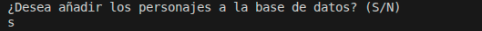
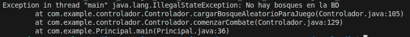
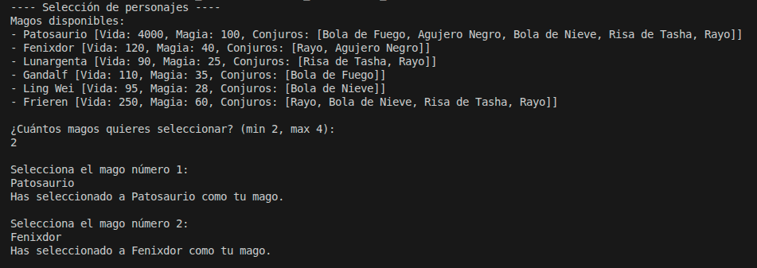
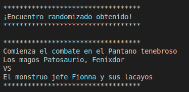
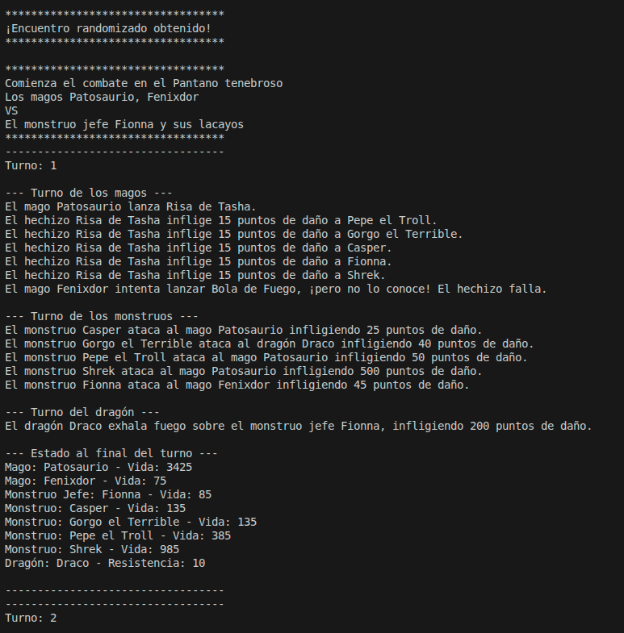
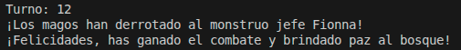

# Manual de usuario
Este documento trata de explicar cómo utilizar este programa. Además de guiar en el funcionamiento del mismo.

## Índice
Índice del manual de usuario
1. Introducción
2. Funcionalidades
   1. Selección de Magos
   2. Juego automático
3. Partida

## 1. Introducción

## 2. Funcionalidades
Este apartado mostrará las funcionalidades de la aplicación.

### Inicio
Al ejecutar el programa, lo primero que se le preguntará al usuario será si desea añadir los personajes a la Base de Datos del programa. Si decide aceptar (S), los datos serán insertados a la BD. Si no (N), se utilizarán los datos ya hayan. 

En el caso de estar vacía y proceder sin añadir los datos, se devolverá un error.
"No hay bosques en la BD" 

### Selección de Magos
El siguiente paso consistirá en elegir los magos que se utilizarán durante la partida. En este caso y para asegurarse de que ambos bandos tengan una oportunidad de alcanzar la victoria, el número mínimo de magos serán 2 y el máximo 4.

Lo primero que se muestra llegado a este punto son los magos utilizables, junto con sus diversas características y los conjuros aprendidos.

Debajo de este menú, se pregunta la cantidad de jugadores deseados. Una vez respondido esto, también se preguntan qué magos en especifico se desean utilizar. Dichos magos serán seleccionados con su nombre y de uno en uno.

### Juego automático
Una vez el equipo de magos es creado, se randomiza el encuentro e inicia la partida. Cada bosque tiene un grupo de monstruos predeterminados, junto con su monstruo jefe que irá variando a medida que vayan muriendo. Además, también cuenta con un dragón aliado de los magos.

Es en este momento que entramos a la partida.

## 3. Partida
El primer mensaje consiste en los partipantes de dicha partida. Primero se menciona el nombre del bosque, después los magos y, finalmente, el nombre del Jefe.

Tras esto, comienza por fin la batalla por la libertad del bosque. El juego es automatizado, por lo que el usuario no deberá hacer nada llegado este punto. Aún así, se irán mostrando como el equipo de magos, los monstruos y el dragón luchan.

Aquí se adjunta como se ve un turno.

El primer turno siempre será de nuestros héroes. Aquí, los magos eligirán un hechizo aleatorio (tanto un ataque en área como uno de un solo objetivo) y, si lo conocen, el ataque se hará con éxito. Si no, fallará y tomará un punto de daño.

El siguiente turno es el de los monstruos, que realizarán ataques simples basados en su nivel de poder. Podrán atacar a los magos o al dragón aliado.

El último turno es del dragón, que siempre atacará al monstruo jefe. Este dragón es aliado de los magos y pretende ayudarles a defender el bosque.

Finalmente, se mostrará el estado actual del juego. Aquí, se verá la vida de los participantes.

A medida que avanza la partida, se irán imprimiendo los diversos turnos junto con los ataques y datos que los conforman. Solo cuando todos los monstruos hayan muerto o nuestros héroes caigan derrotados que termina la partida.

Saber el ganador será sencillo pues un texto indicandolo será lo último en imprimirse.

