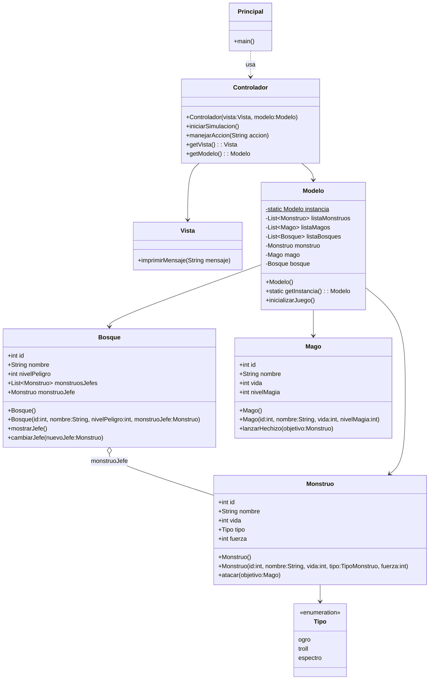
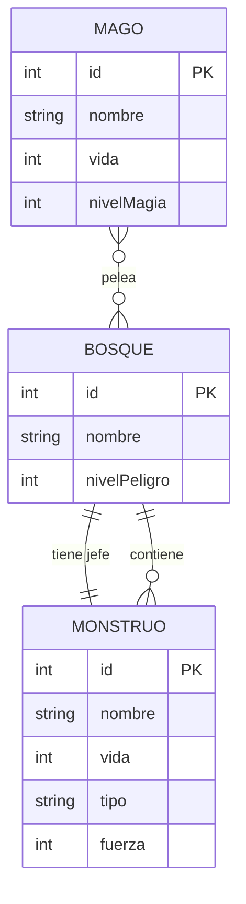

# DragoLandia
## Introducción
Este proyecto pretende probar Hybernate a través de su utilización en un pequeño sistema de peleas automatizado. El programa consiste en que un mago se enfrenta contra un monstruo (ambos elegidos aleatoriamente) y aquel que sobreviva es el ganador.

## Análisis
### Diagrama de Clases

## Diseño
### Diagrama E-R

